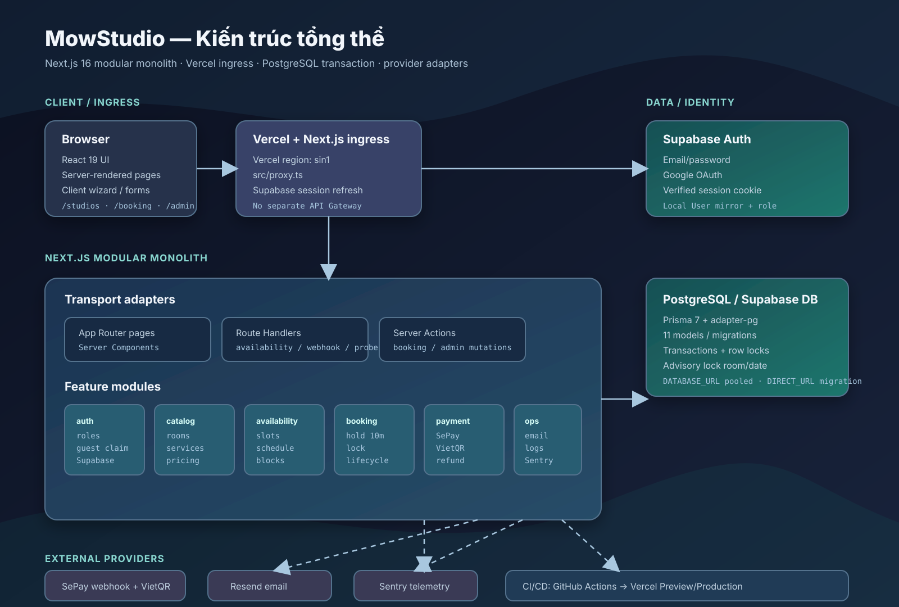

# Báo cáo tổng thể dự án MowStudio

> Ngày rà soát: 2026-08-13  
> Phạm vi: mã nguồn hiện có trong working tree tại thời điểm rà soát. Báo cáo
> không thay đổi các chỉnh sửa đang có sẵn của người dùng.



## 1. Tóm tắt điều hành

MowStudio là web đặt lịch cho creative studio, phục vụ ba không gian:
**Photo Studio**, **Voice/Podcast Booth** và **Music Studio**. Sản phẩm hỗ trợ
catalog phòng/dịch vụ, kiểm tra lịch trống, booking guest, tài khoản khách hàng,
dashboard admin, thanh toán cọc 30% bằng SePay/VietQR, xác nhận booking assisted,
theo dõi refund và email thông báo.

Kiến trúc thực tế là **Next.js App Router modular monolith**:

- Frontend và backend nằm trong cùng một ứng dụng Next.js.
- Server Components render page; Client Components xử lý wizard/form/animation.
- Server Actions và Route Handlers là lớp transport ở phía server.
- Application service chứa use case; repository/provider adapter cô lập Prisma,
  Supabase, SePay, Resend và Sentry.
- PostgreSQL transaction và PostgreSQL advisory lock bảo vệ tính đúng đắn của
  booking đồng thời.

Không thấy một API Gateway riêng như Kong, Nginx, Traefik hoặc AWS API Gateway
trong runtime hiện tại. **Vercel + Next.js proxy/route handlers** đang đóng vai
trò ingress/gateway ứng dụng.

## 2. Số liệu nhanh

| Hạng mục | Hiện trạng |
| --- | --- |
| Kiểu hệ thống | Một Next.js modular monolith |
| Runtime | Node.js >= 24 LTS |
| Package manager | pnpm 11.9.0 qua Corepack |
| App framework | Next.js 16.3.0, App Router, React 19.2.7 |
| Mã nguồn trong `src/` | 242 file |
| Feature module | 141 file trong `src/features/` |
| File App Router/API/action | 39 file trong `src/app/` |
| Prisma model | 11 |
| Prisma enum | 9 |
| Unit/component test file | 65 |
| E2E spec | 12 |
| Media public | 109 file, trong đó 96 frame hero |
| Database local/test | PostgreSQL 18 qua Docker Compose |
| Production hosting được cấu hình | Vercel, region `sin1` |

Các số liệu test/build lịch sử trong `plans/reports/` ghi nhận quality gate
đã từng đạt **203 test hiện tại khi chạy `pnpm test --run`**, và các đợt
verification trước đó ghi nhận production build xanh cùng Playwright desktop/mobile
46 passed / 4 skipped. Kết quả phụ thuộc trạng thái database/fixture tại thời điểm
chạy.

## 3. Tech stack

### 3.1 Frontend

| Nhóm | Công nghệ/cách dùng |
| --- | --- |
| UI framework | React 19.2.7 |
| Web framework | Next.js 16.3.0 App Router |
| Rendering | Server Components mặc định; Client Components có `"use client"` khi cần state/browser API |
| Form | React Hook Form 7.71.1 + `@hookform/resolvers` |
| Validation | Zod 4.4.3 dùng ở cả client/server boundary |
| Styling | Tailwind CSS 4.3.2 qua PostCSS + hệ CSS custom trong `src/styles/*.css` |
| Animation | GSAP 3.15 + ScrollTrigger cho hero/scroll motion |
| Date/time UI | `date-fns`, `date-fns-tz`; timezone chuẩn là `Asia/Ho_Chi_Minh` |
| Image | `next/image`; QR runtime image từ VietQR |
| Font | Bricolage Grotesque, Plus Jakarta Sans, IBM Plex Mono qua `next/font/google` |
| Browser test | Playwright 1.61.1, Chromium desktop và mobile Chrome |

Lưu ý: repo có Tailwind nhưng giao diện chính dựa nhiều vào CSS token/block riêng
(`tokens.css`, `shell.css`, `proof-sheet.css`, `utilities.css`, ...). Không có
dependency riêng của shadcn/ui trong `package.json`; các UI primitive hiện là
component nội bộ.

### 3.2 Backend

| Nhóm | Công nghệ/cách dùng |
| --- | --- |
| Server runtime | Next.js server runtime chạy trên Node.js |
| Transport | Server Actions, Route Handlers, Server Components |
| ORM | Prisma 7.9.1 |
| PostgreSQL driver/adapter | `pg` 8.22.0 + `@prisma/adapter-pg` |
| Database | PostgreSQL; production định hướng Supabase PostgreSQL |
| Schema/migration | `prisma/schema.prisma`, `prisma/migrations/` |
| Business organization | Feature-first, application/domain/infrastructure/presentation |
| Concurrency | `$transaction` + `pg_advisory_xact_lock` theo room và local date |
| API validation | Zod schema tại route/action/use case |
| Error/health | `/api/health`, `/api/ready`, structured JSON logger |

Backend không phải một Express/Nest/Fastify service độc lập. `src/app` là lớp
HTTP/page/action adapter; business logic nằm chủ yếu trong `src/features`.

### 3.3 Dịch vụ ngoài

| Dịch vụ | Vai trò | Bằng chứng trong code |
| --- | --- | --- |
| Supabase Auth | Email/password, Google OAuth, session cookie, email verification | `src/lib/supabase/`, `src/features/auth/` |
| Supabase PostgreSQL | Database hosted; runtime pooler và migration direct URL | `.env.example`, `docs/operations/vercel-runbook.md` |
| SePay | Nhận webhook giao dịch, xác minh HMAC, đối soát payment | `src/features/payment/infrastructure/sepay/` |
| VietQR image endpoint | Sinh ảnh QR động cho transfer | `src/features/payment/infrastructure/sepay/vietqr.ts` |
| Resend | Gửi email booking/payment/cancel/refund-review | `src/features/notification/infrastructure/resend-email-provider.ts` |
| Sentry | Error/performance observability, release/request correlation | `sentry.*.config.ts`, `src/features/observability/` |
| Vercel | Hosting/deploy, build, preview/production, region `sin1` | `vercel.json`, runbook |
| GitHub Actions | Quality, integration, critical E2E và build jobs | `.github/workflows/ci.yml` |

**Chưa có trong runtime hiện tại:** Stripe adapter thực tế, Supabase Storage
client, message queue, worker nền, cron expiry riêng hoặc service API độc lập.
`PaymentProvider` enum trong Prisma có `STRIPE`, nhưng domain/provider hiện chỉ
support `SEPAY`.

## 4. Kiến trúc tổng thể

### 4.1 Các lớp

```text
Browser
  -> Vercel/Next.js ingress
     -> src/proxy.ts (refresh Supabase session cookie)
     -> App Router pages / Route Handlers / Server Actions
        -> src/features/*/application (use cases, policy, RBAC)
           -> domain (pure rules)
           -> infrastructure (Prisma repositories, provider adapters)
              -> PostgreSQL / Supabase Auth / SePay / Resend / Sentry
```

Các module chính:

- `auth`: actor hiện tại, sync local user, CUSTOMER/ADMIN, guest claim.
- `studio-room`: phòng studio và catalog phòng.
- `service`: dịch vụ, giá, duration, buffer, active state.
- `availability`: working hours, blocked slots, thuật toán slot 15 phút.
- `booking`: hold, guest token, overlap, lifecycle, cancel.
- `payment`: deposit, VietQR, SePay webhook, idempotency, late/overpaid review,
  refund status.
- `dashboard`: customer/admin query, list, detail, calendar.
- `notification`: template email, notification log, idempotency.
- `observability`: logger, redaction, request ID, Sentry, readiness.
- `home`: hero scroll/canvas, room selector và presentation.

### 4.2 Gateway/ingress

**Gateway hiện tại:**

1. Vercel nhận request vào deployment Next.js.
2. Next.js `proxy.ts` chạy trước các route phù hợp để refresh Supabase session.
3. Next App Router phân luồng sang page, Route Handler hoặc Server Action.
4. `withRequestContextHandler` tạo/nhận `x-request-id`, thêm header response và
   gắn request ID vào logger/Sentry.

**Các endpoint server quan trọng:**

| Endpoint | Loại | Chức năng |
| --- | --- | --- |
| `GET /api/availability?serviceId=...&date=...` | Route Handler | Trả slot trống, `Cache-Control: no-store` |
| `POST /api/payments/sepay/webhook` | Route Handler | Verify + normalize webhook SePay rồi process payment |
| `GET /api/health` | Liveness | Không đụng DB; trả release SHA |
| `GET /api/ready` | Readiness | `SELECT 1` có timeout 2 giây; lỗi trả 503 |
| `GET /auth/callback` | Auth callback | Đổi Supabase OAuth/email code lấy session |
| `/admin/**` actions | Server Actions | Mutation catalog, schedule, booking lifecycle, refund |

Không có lớp REST controller riêng hoặc API versioning. Đây là lựa chọn phù hợp
MVP modular monolith, nhưng nếu tách mobile app/partner API về sau thì nên tạo
API contract/versioning và gateway policy riêng.

### 4.3 Deploy/runtime

- `vercel.json` khai báo framework `nextjs`, install bằng pnpm frozen lockfile.
- Build command: `prisma generate` -> `check:deploy` -> `next build`.
- Region hiện tại: `sin1`.
- Runtime DB dùng `DATABASE_URL` là Supabase pooler/pgBouncer.
- Migration dùng `DIRECT_URL` non-pooled, chạy tách biệt bằng
  `MIGRATION_CONFIRM=production pnpm migrate:production`.
- Production smoke kiểm tra health, readiness, homepage, catalog và studio detail.
- Tài liệu kế hoạch có nhắc Docker/Caddy/DigitalOcean về sau; đó không phải
  runtime được cấu hình trong `vercel.json` hiện tại.

## 5. Bản đồ frontend và route

### 5.1 Public experience

| Route | Mục đích |
| --- | --- |
| `/` | Hero thương hiệu, scroll/canvas sequence, selector ba phòng |
| `/studios` | Danh sách phòng active |
| `/studios/[slug]` | Chi tiết phòng + dịch vụ |
| `/services/[slug]` | Chi tiết dịch vụ, giá, duration, buffer, CTA booking |
| `/login` | Email/password + Google OAuth |
| `/register` | Đăng ký + email verification |

### 5.2 Booking/customer

| Route | Mục đích |
| --- | --- |
| `/booking/[serviceId]` | Wizard liên hệ -> ngày -> slot -> xác nhận |
| `/booking/[bookingId]/payment` | Countdown, VietQR, thông tin chuyển khoản, trạng thái |
| `/booking/[bookingId]/confirmation` | Receipt/status cho guest có cookie hợp lệ |
| `/account/bookings` | Danh sách booking của user, filter/pagination, claim guest booking |
| `/account/bookings/[id]` | Chi tiết booking và hủy theo policy |

### 5.3 Admin

| Route | Mục đích |
| --- | --- |
| `/admin` | Dashboard tổng quan |
| `/admin/rooms` | CRUD/active phòng |
| `/admin/services` | CRUD/active dịch vụ |
| `/admin/schedule` | Working hours theo weekday |
| `/admin/blocked-slots` | Chặn/mở block lịch |
| `/admin/bookings` | List/filter/pagination booking |
| `/admin/bookings/calendar` | Calendar tối đa khoảng 92 ngày |
| `/admin/bookings/[id]` | Confirm/reject/cancel, demo payment, refund status |
| `/admin/payments` | Theo dõi payment/refund |

## 6. Data model và persistence

### 6.1 Mười một model Prisma

| Model | Vai trò |
| --- | --- |
| `User` | Local identity liên kết `authUserId` từ Supabase, role CUSTOMER/ADMIN |
| `CustomerProfile` | Tên/điện thoại profile khách |
| `StudioRoom` | Phòng studio, timezone, active/order |
| `Service` | Dịch vụ gắn với phòng, type, duration, buffer, giá |
| `WorkingHour` | Cửa sổ giờ mở theo weekday |
| `BlockedSlot` | Khoảng thời gian admin chặn |
| `Booking` | Snapshot customer/room/service, thời gian, tiền, status/lifecycle |
| `Payment` | Payment intent/amount/provider/status cho booking |
| `PaymentEvent` | Event webhook đã nhận, hash, event id, processed time |
| `NotificationLog` | Ý định và kết quả gửi email, recipient masked/hash |
| `AuditLog` | Khung lưu audit actor/action/before/after/request ID |

### 6.2 Invariants dữ liệu đáng chú ý

- Tiền lưu dạng integer VND; `calculateDeposit()` tính cọc 30% bằng `BigInt`
  và làm tròn half-up.
- Booking lưu snapshot `roomName`, `serviceName`, giá và tiền để lịch sử không
  đổi theo catalog hiện tại.
- Booking tạo trong transaction cùng payment pending record.
- Overlap xét cả duration và buffer; active hold `PENDING_PAYMENT` chỉ chiếm slot
  khi `holdExpiresAt` còn hiệu lực.
- Unique `(provider, eventId)` giúp webhook SePay idempotent.
- Unique `(provider, idempotencyKey)` giúp payment intent không tạo trùng.
- Guest chỉ giữ `guestAccessTokenHash`, raw token nằm trong HTTP-only cookie.
- Production runtime/migration tách pooled URL và direct URL.

### 6.3 Điểm cần lưu ý

- `AuditLog` đã có trong schema/index nhưng hiện không thấy application write path
  chủ động ghi audit trong các module đã rà soát; nếu cần audit compliance, cần
  bổ sung service/transaction hook.
- Notification hiện gửi inline sau mutation/payment transition và ghi trạng thái
  `SENT`/`FAILED`; chưa có worker/queue retry độc lập.
- Không có process expiry nền riêng. Availability kiểm tra hold hết hạn tại query;
  status `EXPIRED` chỉ có ý nghĩa khi có flow đánh dấu tương ứng.

## 7. Luồng nghiệp vụ chính

### 7.1 Guest booking

1. Client gọi availability API theo service/date.
2. Server sinh slot theo timezone Việt Nam, working window, block, booking range,
   duration + buffer, bước 15 phút.
3. Wizard gửi `createBookingAction`.
4. Server validate Zod, tạo guest token/hash.
5. Prisma transaction lấy advisory lock theo `roomId:localDate`.
6. Server kiểm tra giờ làm việc, block, overlap lần cuối.
7. Tạo `Booking` ở `PENDING_PAYMENT`, hold 10 phút, và `Payment` pending.
8. Đặt cookie HTTP-only theo `/booking/[bookingId]`.
9. Redirect/render payment page với VietQR.

### 7.2 Payment SePay/VietQR

1. Provider tạo transfer content `BOOKING:<uuid>` và URL ảnh VietQR từ env ngân
   hàng.
2. Khách chuyển khoản cọc.
3. SePay gọi `POST /api/payments/sepay/webhook`.
4. Adapter verify HMAC-SHA256 (production bắt buộc secret), parse Zod và normalize
   event về provider-neutral type.
5. Repository transaction ghi `PaymentEvent`, lock booking/payment, đối soát
   reference/currency/amount cộng dồn.
6. Kết quả: `SETTLED`, `UNDERPAID`, `OVERPAID_REVIEW` hoặc `REJECTED`.
7. `ROOM_ONLY` settled -> `CONFIRMED`; `ASSISTED` settled -> `PENDING` chờ admin.
8. Late payment hoặc overpayment tạo review/refund request; email được gửi và log.

### 7.3 Auth và guest claim

- Supabase xử lý email/password và Google OAuth.
- Chỉ user đã xác minh email mới trở thành actor hợp lệ.
- Local user được upsert mặc định role `CUSTOMER`; role admin được seed bằng
  `scripts/seed-admin.ts`.
- Guest booking xem bằng token hash/cookie.
- Sau khi đăng nhập và verify email, khách có thể claim booking chưa có `userId`
  theo email normalized.
- Admin page/action đều require role server-side; customer vào admin nhận 404,
  guest được redirect login.

### 7.4 Cancellation/refund

- Customer chỉ hủy booking của mình và thông thường phải còn ít nhất 24 giờ.
- Admin có quyền hủy/reject rộng hơn.
- Booking đã paid chuyển `refundStatus=REQUESTED`.
- Refund là trạng thái vận hành thủ công:
  `NONE -> REQUESTED -> PROCESSING -> REFUNDED/REJECTED`.
- App không trực tiếp gọi ngân hàng để hoàn tiền.

## 8. Bảo mật và độ tin cậy

- Secret server-only: `SUPABASE_SERVICE_ROLE_KEY`, DB URLs, SePay secret,
  Resend API key, Sentry auth token.
- Public browser chỉ nhận `NEXT_PUBLIC_SUPABASE_URL` và anon key.
- Không cho browser mutate trực tiếp booking/payment table.
- Guest token dùng hash + constant-time match; cookie `httpOnly`, `SameSite=Lax`,
  `Secure` ở production, path giới hạn theo booking.
- Production webhook signature bắt buộc; payload được hash và event id unique.
- Zod validate input ở route/action/application boundary.
- Role guard nằm trong server code, không dựa vào ẩn link UI.
- Structured JSON log có recursive redaction cho email, phone, token, credential,
  bank account, URL database và request error.
- `x-request-id` được tin cậy có điều kiện (pattern an toàn) hoặc tự sinh UUID;
  response echo lại ID để trace.
- Sentry tắt khi không có DSN; production yêu cầu DSN/source-map config qua
  `validateProductionReadiness`.
- `/api/health` tách khỏi DB để phân biệt process sống với DB outage.
- `/api/ready` dùng bounded `SELECT 1`; failure trả 503 và không lộ connection detail.

## 9. Kiểm thử và CI/CD

### Test layers

- **Unit/domain:** policy booking/payment, overlap, slot generation, money, auth,
  redaction, env, provider parsing.
- **Component:** Testing Library/jsdom cho form, card, navigation, booking UI và
  status components.
- **Integration:** Vitest Node với PostgreSQL thật; đặc biệt transaction,
  advisory lock, booking concurrency, webhook/lifecycle và repository query.
- **E2E:** Playwright Chromium desktop/mobile cho public catalog, guest booking,
  payment, auth, claim, admin denial/catalog/schedule/lifecycle.

### CI jobs

`.github/workflows/ci.yml` chạy:

1. `quality`: install frozen -> `pnpm ci:verify`.
2. `integration`: PostgreSQL 18 service -> generate/migrate -> integration tests.
3. `e2e-critical`: PostgreSQL + seed -> Chromium critical suite.
4. `build`: chỉ chạy sau ba job trên và build production.

### Lệnh vận hành chính

```bash
corepack pnpm ci:verify
corepack pnpm test:integration
corepack pnpm test:e2e
corepack pnpm build
corepack pnpm check:production
MIGRATION_CONFIRM=production DIRECT_URL=<direct-url> corepack pnpm migrate:production
corepack pnpm smoke:production https://<deployment-url>
```

## 10. Cấu hình môi trường

### Bắt buộc cho runtime

- `DATABASE_URL`: PostgreSQL runtime, production nên là Supabase pooler.
- `DIRECT_URL`: PostgreSQL direct cho migration.
- `NEXT_PUBLIC_SUPABASE_URL`, `NEXT_PUBLIC_SUPABASE_ANON_KEY`.
- `SUPABASE_SERVICE_ROLE_KEY`.
- `APP_URL` hoặc `VERCEL_URL`.

### Payment/email/observability

- `PAYMENT_MODE=demo|sepay`.
- `SEPAY_BANK_BIN`, `SEPAY_BANK_ACCOUNT`, `SEPAY_ACCOUNT_NAME`,
  `SEPAY_TRANSFER_PREFIX`, `SEPAY_WEBHOOK_SECRET`.
- `RESEND_API_KEY`, `NOTIFICATION_FROM_EMAIL`.
- `SENTRY_DSN`, `NEXT_PUBLIC_SENTRY_DSN`, `SENTRY_ENVIRONMENT`.
- Build/release: `SENTRY_ORG`, `SENTRY_PROJECT`, `SENTRY_AUTH_TOKEN`,
  `NEXT_PUBLIC_RELEASE_SHA`.

### Test-only

`ALLOW_TEST_ACTOR=true` tạo actor admin/customer giả dựa trên cookie test. Production
readiness gate chủ động từ chối biến này.

## 11. Điểm mạnh hiện tại

- Ranh giới feature/application/repository/provider rõ, dễ mở rộng hơn một codebase
  page-centric.
- Booking concurrency được bảo vệ ở database thay vì chỉ tin client.
- Payment webhook có verify, normalization, idempotency và lock transaction.
- Guest access không dùng public booking ID đơn độc; có token hash/cookie.
- Có customer/admin separation, email verification và server-side RBAC.
- Có health/readiness khác nhau, release SHA, request correlation và redacted logs.
- CI có PostgreSQL thật và critical E2E, không chỉ unit mock.
- Vercel migration production được tách khỏi app boot và có production env gate.

## 12. Rủi ro/khoảng trống cần cân nhắc

| Mức | Quan sát | Tác động/khuyến nghị |
| --- | --- | --- |
| Cao trước production | `RESEND_API_KEY`, SePay secret, bank account thật và Sentry production phải được cấu hình đúng | Chạy `pnpm check:production`; không dùng placeholder/demo |
| Cao trước scale | Chưa có queue/worker cho email và retry | Cân nhắc transactional outbox + worker/cron nếu volume tăng |
| Trung bình | `AuditLog` có schema nhưng chưa thấy write path | Bổ sung audit service cho admin/payment/lifecycle nếu cần compliance |
| Trung bình | Payment confirmation không tự polling; trang cần reload để thấy trạng thái mới | Có thể thêm polling bounded hoặc realtime status nếu UX yêu cầu |
| Trung bình | Refund chỉ tracking, không tích hợp payout/refund provider | Cần quy trình đối soát thủ công rõ ràng |
| Trung bình | Enum có `STRIPE` nhưng implementation chỉ SePay | Hoặc bỏ enum chưa dùng, hoặc lập kế hoạch adapter/test riêng |
| Thấp | Public media/hero nhiều asset lớn | Theo dõi bundle/image bandwidth; cân nhắc CDN/cache khi traffic tăng |
| Thấp | Một số server page admin gọi Prisma trực tiếp | Giữ ở server-only; nếu domain phức tạp hơn thì gom qua query service |

## 13. File và điểm vào nên đọc tiếp

- `package.json`: scripts và dependency contract.
- `vercel.json`: hosting/build/region.
- `prisma/schema.prisma`: domain persistence.
- `src/app/`: pages, API routes, server actions.
- `src/features/`: application/domain/infrastructure/presentation theo feature.
- `src/lib/supabase/`: auth/session cookie integration.
- `src/features/payment/infrastructure/sepay/`: payment adapter + VietQR.
- `src/features/observability/`: logging, redaction, Sentry, readiness.
- `docs/operations/vercel-runbook.md`: release/rollback.
- `docs/operations/incident-checklist.md`: xử lý incident.
- `sơ đồ cho tôi/kien-truc-du-an.html`: bộ sơ đồ interactive có sẵn trong repo.
- `docs/reports/mowstudio-architecture.svg`: sơ đồ kiến trúc tóm tắt được tạo kèm báo cáo này.

## 14. Kết luận

MowStudio hiện là một MVP full-stack có kiến trúc tương đối chắc cho quy mô nhỏ
đến vừa: Next.js đảm nhận cả UI và server transport, Prisma/PostgreSQL giữ dữ liệu
và transaction, Supabase lo identity, SePay lo payment event, Resend lo email,
Sentry/Vercel lo vận hành. “Gateway” không phải thành phần riêng; ingress và API
boundary nằm trong Vercel/Next.js.

Nếu mục tiêu tiếp theo là production thật, thứ tự ưu tiên hợp lý là: hoàn thiện
production secrets/domain, chạy migration + smoke trên Preview, kiểm tra SePay
webhook thật, xác minh Resend sender, sau đó mới đầu tư queue/outbox, audit write
path và payment status realtime khi nhu cầu tăng.
