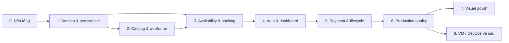

# Kế hoạch triển khai tổng quát MowStudio

> **Dành cho agent triển khai:** BẮT BUỘC dùng sub-skill `superpowers:subagent-driven-development` (khuyến nghị) hoặc `superpowers:executing-plans` để thực hiện lần lượt từng task. Các bước dùng cú pháp checkbox (`- [ ]`) để theo dõi.

**Mục tiêu:** Xây dựng web booking creative studio bằng tiếng Việt, sẵn sàng chạy production và đủ chiều sâu cho portfolio intern full-stack; sau đó bổ sung phase triển khai VM để thể hiện năng lực DevOps.

**Tiến độ hiện tại (2026-07-04):** Phase 0, 1 và 2 đã hoàn tất; gate kế tiếp là Phase 3 — availability và atomic booking.

**Kiến trúc:** Một Next.js App Router modular monolith, tổ chức theo feature. Application service phía server quản lý use case và state transition; repository quản lý Prisma/PostgreSQL; provider adapter cô lập Supabase, SePay, email và Sentry. Tính đúng đắn dựa trên database transaction và PostgreSQL advisory lock, không dựa vào state phía client hoặc background job.

**Tech stack:** Node.js 24 LTS, pnpm, Next.js 16 stable (không dùng preview release), React 19, TypeScript, Tailwind CSS, shadcn/ui, React Hook Form, Zod, Prisma ORM 7, Supabase Auth/PostgreSQL/Storage, Vitest, Playwright, Sentry, GitHub Actions, Vercel; về sau thêm Docker, Caddy, GHCR và DigitalOcean Ubuntu.

Baseline phiên bản được kiểm tra ngày 2026-07-03 theo [Next.js release blog](https://nextjs.org/blog), [lịch phát hành Node.js](https://nodejs.org/en/about/previous-releases) và [yêu cầu hệ thống của Prisma](https://docs.prisma.io/docs/orm/reference/system-requirements). Phase 0 phải khóa chính xác patch version trong `pnpm-lock.yaml`; chỉ nâng version qua một task dependency được review riêng.

## Ràng buộc toàn cục

- UI và email giao dịch dùng tiếng Việt; identifier trong code và tài liệu kỹ thuật dùng tiếng Anh.
- Timezone sản phẩm là `Asia/Ho_Chi_Minh`; lưu instant bằng UTC và diễn giải working hour theo giờ địa phương của room.
- MVP chỉ đặt đúng một service thuộc một room; không có cart, combo, membership, voucher, equipment hoặc staff selection.
- Service có loại `ROOM_ONLY` hoặc `ASSISTED`; tiền cọc luôn là 30% và lưu bằng số nguyên VND.
- Slot bắt đầu theo lưới 15 phút; kiểm tra overlap phải tính cả duration và buffer.
- Booking hold đúng 10 phút và bắt đầu ở trạng thái `PENDING_PAYMENT`.
- Server là nguồn sự thật cho availability, pricing, authorization và state transition.
- Tạo booking và khôi phục late payment dùng PostgreSQL transaction-level advisory lock theo room và ngày địa phương.
- Notification là side effect sau commit và không được rollback booking/payment.
- Mặc định dùng Server Component; chỉ dùng Client Component khi có interaction boundary rõ ràng.
- Hoàn tất booking journey 2D trước visual polish hoặc 3D.
- Không có yêu cầu đúng đắn nào phụ thuộc scheduled worker.
- MVP không dùng Jenkins, microservices, Kubernetes, Prometheus, Grafana hoặc OpenTelemetry.
- Mọi thay đổi hành vi bắt đầu bằng failing test, kết thúc bằng focused verification và conventional commit nhỏ.
- Nguồn sự thật chi tiết: `docs/superpowers/specs/2026-07-03-mowstudio-design.md`.
- Task triển khai chi tiết: `docs/superpowers/plans/2026-07-03-mowstudio-phase-plan.md`.

---

## 1. Bản đồ triển khai

| Phase | Kết quả | Phụ thuộc | Điều kiện hoàn tất |
|---|---|---|---|
| 0. Nền tảng repository | Project tái lập được, PostgreSQL test local, CI cơ bản, hợp đồng environment | Spec và plan đã duyệt | Cài sạch, lint, typecheck, unit test, integration smoke test và production build đều chạy |
| 1. Domain và persistence | Schema ổn định, seed catalog, domain primitive, transaction boundary của repository | Phase 0 | Migration và seed chạy; test state/time/money pass |
| 2. Catalog và wireframe | Public discovery và admin CRUD room/service có guard | Phase 1 | Browse đúng ba room/service; authorization admin được cưỡng chế |
| 3. Availability và atomic booking | Schedule, blocked slot, availability API, guest wizard 5 bước, hold 10 phút | Phase 1–2 | Hai request tranh cùng slot chỉ có đúng một booking thành công |
| 4. Auth và dashboard | Supabase login/register/Google, RBAC, ownership, claim, account/admin booking view | Phase 3 | Guest claim và non-admin denial pass E2E |
| 5. Payment và lifecycle | SePay/VietQR, webhook idempotent, transition theo booking type, admin confirm, cancellation/refund, email | Phase 3–4 | Payment-to-status và late-payment reconciliation pass integration/E2E |
| 6. Production quality và Vercel | Sentry, JSON log, health/readiness, CI đầy đủ, Preview/Production workflow | Phase 0–5 | Production smoke test và quality gate pass, có release SHA |
| 7. Visual polish | UI responsive có bản sắc và 3D marketing hero hiệu năng tốt nếu phù hợp | Functional MVP | Booking vẫn accessible/nhanh; reduced-motion và mobile fallback được kiểm chứng |
| 8. VM/DevOps về sau | Container deploy từ GHCR lên DigitalOcean qua Caddy, có health-check rollback | Production app ổn định; kích hoạt credit gần kỳ nộp CV | Deploy theo version và rollback lỗi được kiểm thử trên VM |

## 2. Critical path

Critical path là Phase 0 → 1 → 3 → 4 → 5 → 6. Phase 2 cung cấp UI service/room cần thiết cho Phase 3. Phase 7 và 8 nằm ngoài functional MVP, không chặn lần deploy portfolio đầu tiên.

## 3. Milestone

### M1 — Khung kỹ thuật (Phase 0–1)

Repository tái lập được, CI hoạt động, PostgreSQL integration test chạy, domain model đã migrate và seed thể hiện ba room. Chưa xây UI ngoài app shell tối thiểu.

### M2 — Có thể booking, chưa thanh toán (Phase 2–3)

Guest có thể tìm service, xem availability thật, hoàn thành wizard và nhận booking hold an toàn trong 10 phút. Concurrency phải được chứng minh trên PostgreSQL trước khi thêm auth hoặc payment.

### M3 — Hệ thống đa role có thể vận hành (Phase 4)

Customer và admin có trải nghiệm khác nhau được cưỡng chế phía server. Guest claim, account history, admin calendar/detail và denial path hoạt động.

### M4 — Hoàn chỉnh financial lifecycle (Phase 5)

SePay deposit, webhook idempotency, assisted confirmation, cancellation, refund tracking, audit và transactional email đều hoạt động với failure behavior rõ ràng.

### M5 — MVP production công khai (Phase 6)

Sản phẩm end-to-end pass CI và production smoke check trên Vercel, có migration, monitoring, request correlation, health/readiness và release traceability.

### M6 — Portfolio polish (Phase 7)

Marketing surface có bản sắc hơn mà không ảnh hưởng booking funnel, accessibility, Core Web Vitals hoặc thiết bị mobile/low-power.

### M7 — Trình diễn DevOps (Phase 8, làm sau)

Khoảng 2–3 tháng trước khi nộp CV, kích hoạt DigitalOcean credit và trình diễn image build, registry publish, SSH deployment, TLS, readiness validation và rollback.

## 4. Quy tắc dependency và thứ tự

- Khóa enum, money và time convention ở Phase 1 trước khi UI sử dụng.
- Chứng minh overlap SQL và advisory lock trước khi tích hợp SePay.
- Không dùng mocked repository làm bằng chứng cho concurrency correctness.
- Hoàn tất guest booking trước auth; authenticated booking phải mở rộng cùng use case, không tạo nhánh riêng.
- Hoàn tất ownership và RBAC trước khi mở admin confirmation hoặc refund action.
- Xây payment normalization và idempotency trước provider-specific webhook transition.
- Chỉ thêm notification intent sau khi transition idempotency đã được chứng minh.
- Production migration chạy như release step có guard, không tự chạy tùy tiện khi app startup.
- Visual/3D không được thay đổi booking domain API.
- VM deployment dùng lại production image/build contract, không tạo kiến trúc app thứ hai.

## 5. Quality gate theo milestone

| Gate | M1 | M2 | M3 | M4 | M5+ |
|---|---:|---:|---:|---:|---:|
| Format/lint/typecheck/build | Bắt buộc | Bắt buộc | Bắt buộc | Bắt buộc | Bắt buộc |
| Vitest domain/unit | Bắt buộc | Bắt buộc | Bắt buộc | Bắt buộc | Bắt buộc |
| PostgreSQL integration thật | Smoke | Bắt buộc lock/overlap | Ownership query | Bắt buộc webhook/lifecycle | Toàn bộ suite |
| Playwright | App smoke | Guest booking | Auth/RBAC/claim | Payment/admin/cancel | Critical suite |
| Accessibility | Shell | Wizard cơ bản | Dashboard | Payment/cancel state | Automated + keyboard manual pass |
| Security review | Secret/env | Guest token/raw SQL | RBAC/ownership | Webhook/payment/PII | Release checklist |
| Observability | CI failure | Thiết kế correlation | Audit coverage | Provider failure | Bằng chứng Sentry/log/uptime production |

## 6. Định nghĩa MVP release

MVP chỉ hoàn tất khi đạt M5. Landing page đẹp nhưng thiếu financial lifecycle, concurrency evidence hoặc authorization denial test không được xem là MVP. Ngược lại, 3D ở Phase 7 và VM deployment ở Phase 8 không bắt buộc để gọi functional product là hoàn chỉnh.

Bằng chứng release cần có:

- URL CI run và release SHA đã deploy;
- migration version và production state không dùng seed giả;
- screenshot hoặc video ngắn của guest journey và assisted journey;
- concurrency test và webhook integration test pass;
- non-admin denial E2E pass;
- health/readiness response và Sentry release hiển thị đúng;
- README ngắn gọn có link architecture/runbook.

## 7. Risk register

| Rủi ro | Dấu hiệu sớm | Cách giảm thiểu / phase sở hữu |
|---|---|---|
| Double booking khi concurrent | Unit test pass nhưng hai request song song đều insert | Integration test PostgreSQL dùng barrier ở Phase 3 |
| Vercel cạn DB connection | Preview/load thỉnh thoảng timeout DB | Supabase pooled runtime URL, direct migration URL, giới hạn connection ở Phase 0/6 |
| Webhook ngân hàng trùng hoặc đến muộn | Gửi email lặp hoặc khôi phục slot sai | Provider event ledger, row lock, advisory lock, late-payment branch ở Phase 5 |
| Lộ dữ liệu guest booking | Chỉ cần booking ID đã xem được detail | Token entropy cao, chỉ lưu hash và ownership check ở Phase 3 |
| Auth identity lệch | Có Supabase user nhưng thiếu local role/profile | Local user sync idempotent, mặc định `CUSTOMER` ở Phase 4 |
| Lỗi biên timezone | Sai weekday hoặc slot qua nửa đêm | Zoned conversion unit test và lưu UTC ở Phase 1/3 |
| Notification failure ảnh hưởng booking | Provider outage làm webhook trả 500 | Notification intent/log sau commit và retry giới hạn ở Phase 5 |
| Scope phình | Task xuất hiện cart/equipment/staff | Loại theo Ràng buộc toàn cục; chỉ ghi roadmap |
| 3D làm giảm conversion/hiệu năng | LCP chậm hoặc mobile giật | Lazy desktop enhancement, static fallback, performance budget ở Phase 7 |
| Kích hoạt VM credit quá sớm | Hạ tầng nằm không nhiều tháng trước kỳ CV | Dùng Vercel trước; kích hoạt credit 2–3 tháng trước khi apply |

## 8. Nhịp quản lý dự án

- Thực hiện từng phase theo phase plan chi tiết.
- Khi bắt đầu phase, xác nhận prerequisite và chỉ đánh dấu task đầu tiên là in progress.
- Mỗi task là một review boundary, kết thúc bằng focused test và conventional commit.
- Cuối phase, chạy verification matrix và ghi bằng chứng trong phase plan hoặc project log.
- Chỉ sửa master plan khi scope, thứ tự hoặc milestone thay đổi; implementation note đặt ở phase plan.
- Dừng và sửa design spec trước khi thay đổi booking invariant, money rule, role hoặc payment semantic.

## 9. Điểm dừng khuyến nghị cho CV

- **Demo tối thiểu đủ thuyết phục:** M3 — có câu chuyện tốt về scheduling/concurrency/RBAC nhưng chưa có payment lifecycle thật.
- **Phiên bản khuyến nghị để ứng tuyển:** M5 — full-stack product hoàn chỉnh với payment và production operations.
- **Phiên bản tạo khác biệt:** M6 + M7 — product được polish và có câu chuyện DevOps deployment riêng.

Ưu tiên đạt M5 trước. Xem M6 và M7 là upgrade độc lập để chúng không trì hoãn portfolio hoạt động được.
